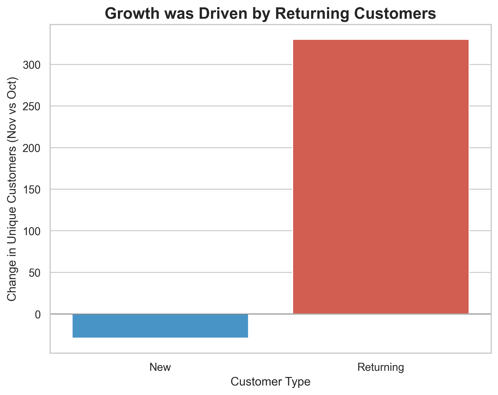
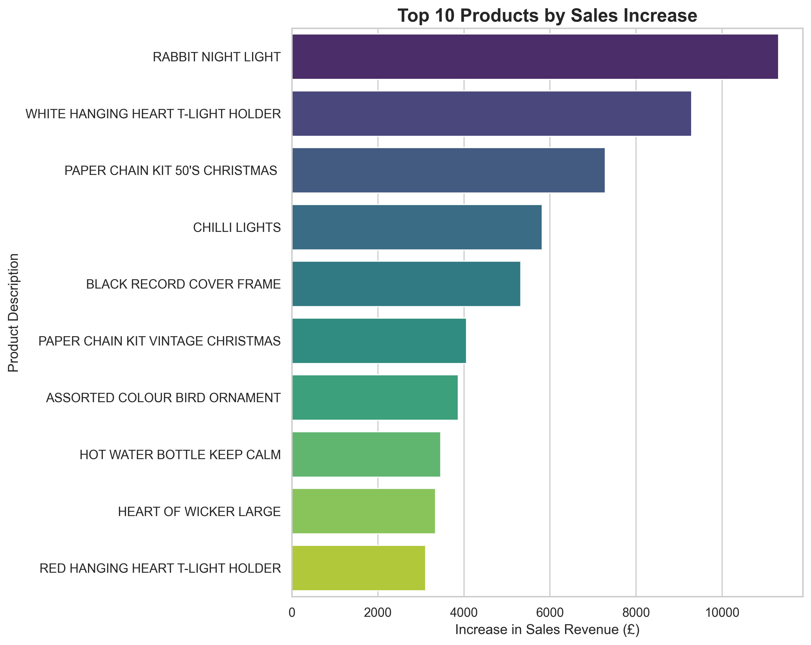

# E-commerce Sales Analysis: Uncovering Seasonal Success

## Business Problem
This project began as an investigation into a reported 20% drop in customer conversion rate. However, initial data cleaning revealed that the drop was an illusion caused by incomplete data. The project's focus then shifted to analyzing a newly discovered **13% increase in conversion rate** between October and November 2011 to identify the key drivers of this success.

## Data Source
The dataset is the "Online Retail II UCI" dataset from Kaggle, containing transactional data for a UK-based online retailer.
[Link to Dataset](https://www.kaggle.com/datasets/mashlyn/online-retail-ii-uci)

## Tech Stack
* **Language:** Python
* **Libraries:** Pandas (for data manipulation), Matplotlib & Seaborn (for visualization)

---

## Key Findings & Insights

### 1. Growth is Driven by Returning Customers
The 13% conversion rate increase was powered almost exclusively by our existing customer base. The number of unique returning customers grew by **330**, while new customers saw a slight decrease of **29**. This highlights the immense value of our loyal customers.

### 2. Success is UK-Centric and Seasonal
The growth was geographically concentrated in the **United Kingdom**, which saw an increase of **276 unique customers**. Furthermore, the top-selling products were overwhelmingly seasonal, indicating that the surge was driven by early holiday shopping.

---

## Actionable Recommendations
Based on the analysis, I recommend the following strategic actions:

1.  **Launch a Targeted VIP Campaign:** Create an email marketing campaign specifically for returning UK customers, offering them early access or exclusive deals on our holiday collection.
2.  **Analyze New Customer Acquisition:** Investigate why new customer acquisition faltered during the start of a key shopping season to identify and fix potential issues in our marketing funnel.
3.  **Plan for Next Year:** Proactively plan next year's holiday marketing calendar around this predictable seasonal surge from loyal customers.

## Lessons Learned
* **The Importance of Data Cleaning:** A project's direction can completely change after a thorough cleaning. The initial problem was based on faulty data.
* **Question the Premise:** Always validate the initial business problem with the data before diving into deep analysis.
